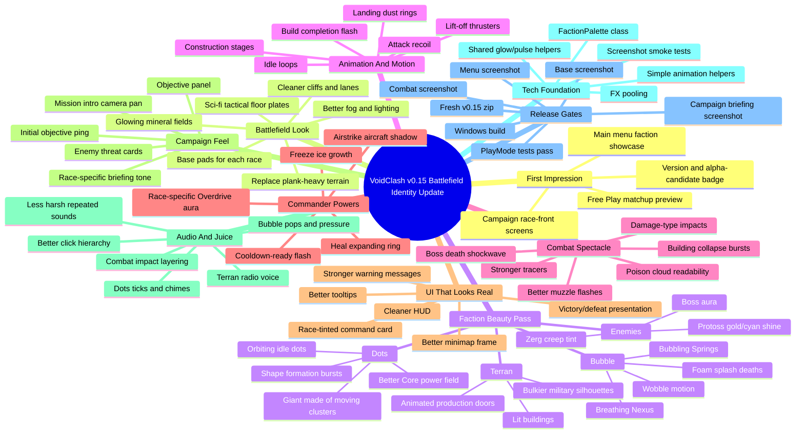

# VoidClash v0.15 - Battlefield Identity Update Mind Map

Goal: make VoidClash finally look good while still staying honest as pre-alpha / alpha candidate.

Core idea: the game already has systems. The next update should make every screenshot say: "this is a real game now."

## Implemented First Slice - 2026-07-08

- Sci-fi tactical ground plate texture replaced the old simple checker ground.
- Player and enemy base pads now frame the opening bases.
- Center beacon, lane guides, and cliff-edge glow make the battlefield readable.
- Signal lamps pulse and signal dishes rotate for ambient motion.
- Units gained idle bob/sway; building accent pieces pulse.
- Melee attacks gained swipe arcs; hitscan/melee impacts now vary by damage class.
- HUD gained a race-accent top edge and objective strip.
- Smoke tests now verify the base pads and center beacon exist.

## Expanded Build Targets

### First Impression

- Main menu animated faction showcase.
- Better title treatment and alpha-candidate badge.
- Free Play matchup preview with player race, AI race, and difficulty personality.
- Campaign panels for Terran, Bubble, and Dots that feel like separate fronts.

### Actual Battlefield Look

- Replace the current plank-heavy terrain with clean sci-fi tactical floor plates.
- Add readable lane borders, cleaner cliffs, and base pads.
- Make minerals glow and shimmer so economy has visible value.
- Reduce dark-blue mush by improving fog, lighting, and distance contrast.

### Faction Beauty Pass

- Terran: compact military silhouettes, lit buildings, production doors.
- Bubble: wobble motion, foam splash deaths, breathing Nexus, bubbling Springs.
- Dots: idle orbits, shape formation bursts, polished Core power field, moving Giant clusters.
- Enemies: Zerg creep tint, Protoss shine, rebel Terran red metal, boss aura.

### Animation And Motion

- Unit idle loops, move lean, attack recoil, death effects, selection pulse.
- Building construction stages, completion flash, training glow.
- Lift-off thrusters and landing dust/ring.
- Ambient world motion on signal arrays, expansion pylons, and center landmark.

### Combat Spectacle

- Better muzzle flash, projectile trails, and damage-type impacts.
- Melee swipe arcs and armor sparks.
- Building collapse burst and boss death shockwave.
- Bubble poison clouds and Dots Core release visuals.

### UI That Looks Real

- Compact top bar, better minimap frame, race-tinted command card.
- Better objective plaque and warning hierarchy.
- Cleaner disabled command state and tooltips.
- Victory/defeat screens with stronger presentation.

### Campaign Feel

- Briefings with enemy threat panel, objective panel, recommended tactic, and race accent.
- Mission intro camera pan from base to threat.
- Initial objective ping and auto-select the key starting unit/building.
- Race arcs should feel separate and intentional.

### Audio And Juice

- Better UI click hierarchy.
- Less harsh repeated combat sounds.
- Stronger big-event bass and ability-ready stings.
- Terran radio voice, Bubble pressure/pops, Dots ticks/chimes.

### Tech Foundation

- `FactionPalette` constants.
- Simple bob/lean/recoil animation helpers.
- Shared glow/pulse helpers.
- FX pooling for common effects.
- Screenshot smoke tests for menu, base, combat, and briefing.

## Priority Order

1. Screenshot pass.
2. Battlefield material pass.
3. Faction silhouette pass.
4. Combat feedback pass.
5. UI skin pass.
6. Campaign presentation pass.
7. Verification and packaging.

## Hard Rule For This Update

Do not add a fourth race or a huge new mechanic until the current game looks good in screenshots.

This update wins if someone sees one screenshot and thinks:

> "Okay, this is still early, but it has a real identity now."
