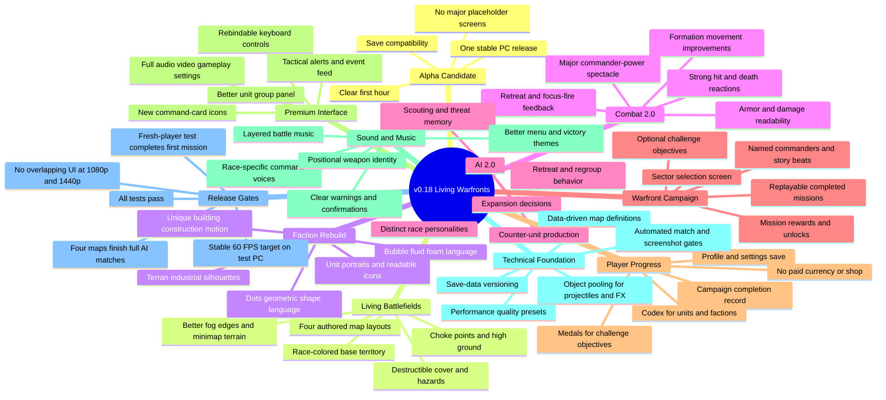

# VoidClash v0.18 - Living Warfronts

Largest update goal: turn the PC prototype into an alpha candidate while keeping the existing
economy, combat, factions, campaigns, and controls playable throughout development.

## Build Order

1. Foundation: map definitions, save versioning, performance measurements, and placeholder-free UI routes.
2. Battlefield vertical slice: finish one Terran-versus-Bubble map to final v0.18 quality.
3. Factions and combat: rebuild silhouettes, effects, icons, audio, formation movement, and battle feedback.
4. AI 2.0: scouting, memory, counters, regrouping, and race personalities on the vertical-slice map.
5. Warfront campaign: sector selection, rewards, optional objectives, mission replay, and profile saves.
6. Scale out: complete three more maps and apply the quality bar to every race and mission.
7. Alpha gate: balance, accessibility/settings, performance, fresh-player testing, packaging, and screenshots.

## Scope Rules

- PC only for v0.18.
- No fourth playable faction.
- No multiplayer yet; AI and campaign quality come first.
- Existing mechanics stay playable while their presentation is replaced.
- One finished vertical slice sets the quality bar before content is multiplied.

## Success Sentence

> VoidClash v0.18 feels like a small real RTS in alpha, not a collection of prototype systems.
